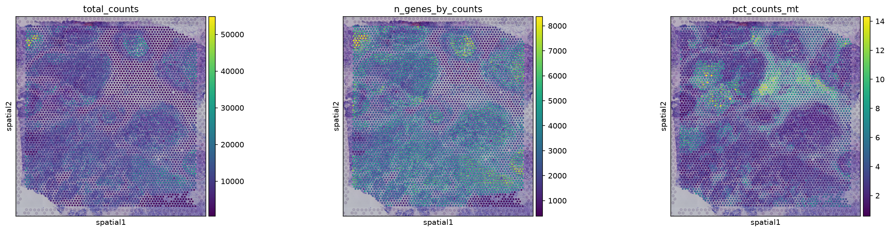
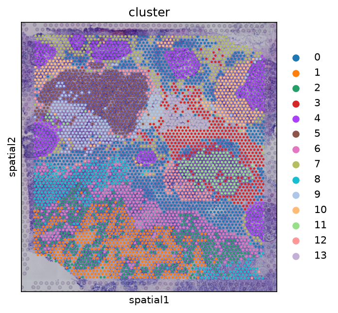

# SpatialPath

A reproducible pipeline for 10x Visium spatial transcriptomics.

**Year:** 2026
**License:** MIT
**Author:** Sepideh Moafi


---

## Overview

SpatialPath processes 10x Visium spatial transcriptomics data end to end.
It reads the standard 10x output, computes quality-control metrics, applies
leakage-safe normalization, selects highly variable genes, clusters spots
with PCA and Leiden, and estimates cell-type proportions with ridge
regression.

The pipeline is written as a research software engineering deliverable.
Components are isolated, tests cover each module, the container image is
reproducible, and continuous integration runs on every push. The pipeline
has been validated on the publicly available 10x Genomics Visium Human
Breast Cancer dataset.

---

## What it does

- Reads 10x Visium output (`filtered_feature_bc_matrix.h5` and `spatial/`).
- Computes QC metrics: total counts, genes per spot, mitochondrial fraction.
- Filters low-quality spots and genes.
- Normalizes counts per spot and applies a log transform.
- Selects highly variable genes.
- Reduces dimensions with PCA.
- Builds a k-nearest-neighbor graph.
- Clusters spots with Leiden.
- Ranks marker genes per cluster.
- Estimates cell-type proportions with ridge regression.
- Writes spatial QC and cluster plots.
- Saves a structured JSON report.

---

## Results

Validated on the 10x Genomics Visium Human Breast Cancer dataset.

| Metric | Value |
|--------|-------|
| Spots | 4,869 |
| Genes | 21,349 |
| Median genes per spot | 3,667 |
| Median counts per spot | 9,744 |
| Median mitochondrial fraction | 2.88% |
| Clusters | 14 |

The median mitochondrial fraction of 2.88% indicates high data quality
without additional filtering. The Leiden resolution produced fourteen
spatial clusters whose sizes range from 83 to 722 spots.

### Feature plots





The structured report is available at [`figures/report.json`](figures/report.json).

---

## Data

The pipeline is validated on:

- **10x Genomics Visium Human Breast Cancer**
  - Source: 10x Genomics
  - URL: https://www.10xgenomics.com/datasets
  - Format: `filtered_feature_bc_matrix.h5` and `spatial/`
  - License: Public

---

## Install

```bash
git clone https://github.com/AIResearcher20/spatialpath.git
cd spatialpath
pip install -r requirements.txt
pip install -e .
```

---

Run

Place a Visium dataset under data/ and run:

```bash
spatialpath data/visium_demo --output-dir results
```

The output directory contains:

· processed.h5ad
· report.json
· figures/qc.png
· figures/clusters.png

---

Test

```bash
pytest tests -v
```

---

Docker

```bash
docker build -t spatialpath .
docker run spatialpath python -m spatialpath.cli --help
```

---

Project Structure

```
spatialpath/
├── .github/
│   └── workflows/
│       ├── ci.yml
│       └── run_pipeline.yml
├── configs/
│   └── default.yaml
├── figures/
│   ├── qc.png
│   ├── clusters.png
│   └── report.json
├── src/
│   └── spatialpath/
│       ├── __init__.py
│       ├── __main__.py
│       ├── cli.py
│       ├── cluster.py
│       ├── deconvolve.py
│       ├── io.py
│       ├── normalize.py
│       ├── plot.py
│       ├── qc.py
│       └── report.py
├── tests/
│   ├── __init__.py
│   ├── conftest.py
│   ├── test_cluster.py
│   ├── test_deconvolve.py
│   ├── test_io.py
│   ├── test_normalize.py
│   └── test_qc.py
├── .gitignore
├── CITATION.cff
├── Dockerfile
├── LICENSE
├── README.md
├── pyproject.toml
└── requirements.txt
```

---

Technologies

Python · Scanpy · Squidpy · AnnData · scikit-learn · matplotlib ·
PyYAML · pytest · Docker · GitHub Actions

---

Limitations

· Validated on a single public dataset.
· Deconvolution uses ridge regression, not a specialized tool such as
  cell2location or Tangram.
· Spatial domain detection is not implemented.
· The pipeline does not handle structural or copy-number variants.

---

Citation

See CITATION.cff.

---

License

MIT

``
