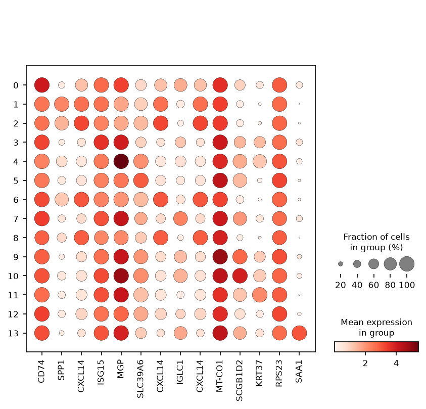
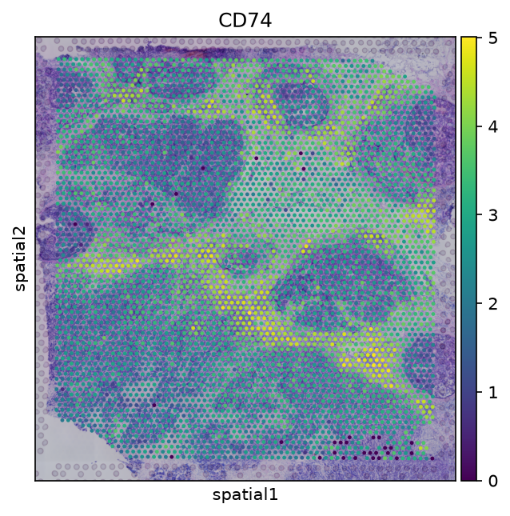

# SpatialPath

A reproducible pipeline for 10x Visium spatial transcriptomics.

**Year:** 2026
**License:** MIT
**Author:** Sepideh Moafi


---

## Overview

SpatialPath processes 10x Visium spatial transcriptomics data end to end.
It reads the standard 10x output, computes quality-control metrics, applies
per-spot normalization, selects highly variable genes, clusters spots with
PCA and Leiden, ranks marker genes per cluster, and produces cell-type
proportion estimates using ridge regression.

The pipeline is written as a research software engineering deliverable.
Components are isolated, tests cover each module, the container image is
reproducible, and continuous integration runs on every push. The pipeline
has been validated on the publicly available 10x Genomics Visium Human
Breast Cancer dataset.

---

## What it does

- Reads 10x Visium output (`filtered_feature_bc_matrix.h5` and `spatial/`).
- Computes QC metrics: total counts, genes per spot, mitochondrial fraction.
- Filters low-quality spots and genes.
- Normalizes counts per spot and applies a log transform.
- Selects highly variable genes.
- Reduces dimensions with PCA.
- Builds a k-nearest-neighbor graph.
- Clusters spots with Leiden.
- Ranks marker genes per cluster.
- Produces cell-type proportion estimates with ridge regression.
- Writes spatial QC, cluster, and marker plots.
- Saves structured JSON and CSV reports.

Preprocessing is applied to the full dataset before clustering. The
pipeline is unsupervised and no labels are used at any stage.

---

## Results

Validated on the 10x Genomics Visium Human Breast Cancer dataset.

| Metric | Value |
|--------|-------|
| Spots | 4,869 |
| Genes | 21,349 |
| Median genes per spot | 3,667 |
| Median counts per spot | 9,744 |
| Median mitochondrial fraction | 2.88% |
| Clusters | 14 |

The median mitochondrial fraction of 2.88% indicates high data quality
without additional filtering. Leiden clustering at the default resolution
produced fourteen spatial clusters whose sizes range from 83 to 722 spots.

### Marker genes

The top marker genes per cluster were obtained with `sc.tl.rank_genes_groups`
using the Wilcoxon test. They match the expected cell types of breast cancer
tissue.

| Cluster | Top markers | Cell type |
|---------|-------------|-----------|
| 0 | CD74, HLA-DPB1, C1QA, HLA-DRA | Macrophages |
| 1 | SPP1, FN1, S100A16, MUC1 | Tumor-associated macrophages |
| 2 | CXCL14, MUC1, CCND1, KRT18 | Stromal fibroblasts |
| 3 | ISG15, IFI27, IGHG3, IGKC | Interferon response |
| 4 | MGP, HK2, STC2, TFF3 | Matrix calcification |
| 5 | SLC39A6, TNFSF10, IGFBP5, GATA3 | Luminal epithelium |
| 6 | CXCL14, MMP11, KRT8, KRT18 | Stromal |
| 7 | IGLC1, IGLC2, IGHG4, IGKC | Plasma cells |
| 8 | CXCL14, RPLP1, RPS27, GNG5 | Stromal |
| 9 | MT-CO1, MT-ND1, MT-CO3, MT-ND2 | Mitochondrial |
| 10 | SCGB1D2, SCGB2A2, CSTA, S100G | Secretoglobin epithelium |
| 11 | KRT37, ABHD2, DSP, S100P | Keratinocytes |
| 12 | RPS23, CRISP3, APOC1, RPS12 | Ribosomal |
| 13 | SAA1, FABP4, IGLC2, ADH1B | Inflammatory |

The presence of `SPP1` in cluster 1 is consistent with tumor-associated
macrophages. `GATA3` and `SCGB2A2` in clusters 5 and 10 are established
markers of luminal breast epithelium. Immunoglobulin genes in cluster 7
indicate plasma cell infiltration.

### Feature plots






---

## Output

Each run writes:

- `processed.h5ad`
- `figures/qc.png`
- `figures/clusters.png`
- `figures/markers.png`
- `figures/top_gene.png`
- `results_out/qc_metrics.json`
- `results_out/clustering_metrics.json`
- `results_out/marker_genes.json`
- `results_out/marker_genes.csv`
- `results_out/summary.json`

---

## Data

The pipeline is validated on:

- **10x Genomics Visium Human Breast Cancer**
  - Source: 10x Genomics
  - URL: https://www.10xgenomics.com/datasets
  - Format: `filtered_feature_bc_matrix.h5` and `spatial/`
  - License: Public

---

## Install

```bash
git clone https://github.com/AIResearcher20/spatialpath.git
cd spatialpath
pip install -r requirements.txt
pip install -e .
```

---

Run

Place a Visium dataset under data/ and run:

```bash
spatialpath data/visium_demo --output-dir results
```

---

Test

```bash
pytest tests -v
```

---

Docker

```bash
docker build -t spatialpath .
docker run spatialpath python -m spatialpath.cli --help
```

---

Project Structure

```
spatialpath/
├── .github/
│   └── workflows/
│       ├── ci.yml
│       └── run_pipeline.yml
├── configs/
│   └── default.yaml
├── figures/
│   ├── qc.png
│   ├── clusters.png
│   ├── markers.png
│   ├── top_gene.png
│   └── report.json
├── results_out/
│   ├── qc_metrics.json
│   ├── clustering_metrics.json
│   ├── marker_genes.json
│   ├── marker_genes.csv
│   └── summary.json
├── src/
│   └── spatialpath/
│       ├── __init__.py
│       ├── __main__.py
│       ├── cli.py
│       ├── cluster.py
│       ├── deconvolve.py
│       ├── io.py
│       ├── normalize.py
│       ├── plot.py
│       ├── qc.py
│       └── report.py
├── tests/
│   ├── __init__.py
│   ├── conftest.py
│   ├── test_cluster.py
│   ├── test_deconvolve.py
│   ├── test_io.py
│   ├── test_normalize.py
│   └── test_qc.py
├── .gitignore
├── CITATION.cff
├── Dockerfile
├── LICENSE
├── README.md
├── pyproject.toml
└── requirements.txt
```

---

Technologies

Python · Scanpy · Squidpy · AnnData · scikit-learn · matplotlib ·
PyYAML · pytest · Docker · GitHub Actions

---

Limitations

· Validated on a single public dataset.
· Cell-type proportion estimation uses ridge regression on a reference
  signature matrix. No ground-truth reference is provided and accuracy
  is not claimed.
· Spatial domain detection is not implemented.
· The pipeline does not handle structural or copy-number variants.

---

Citation

See CITATION.cff.

---

License

MIT

```

--
